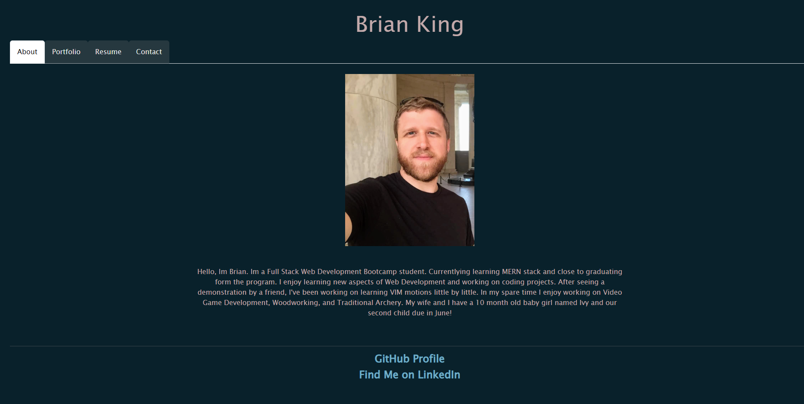

# 20 React: React Portfolio
Personal Portfolio created in React.js

## Description
Uses Node.js Express, React.js

## Installation
Run  'npm i'  to install dependencies.

## Usage
Input 'npm start' to start server.

Link to github repository:
https://github.com/kingbgreen5/resume-round-two

Link to Deployed Application:
https://adorable-speculoos-e15caa.netlify.app/resume

## Credits
Starter code taken from Edx Bootcamp activities
 
